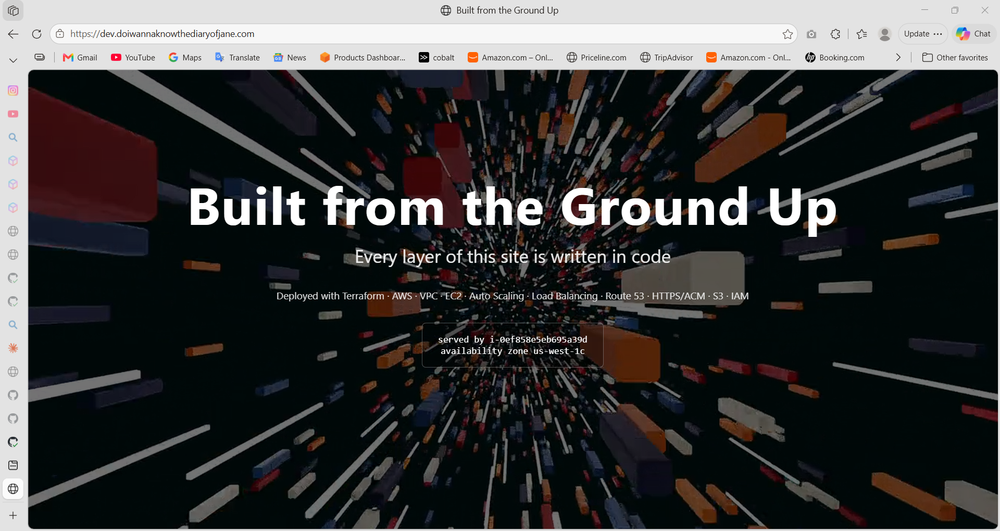
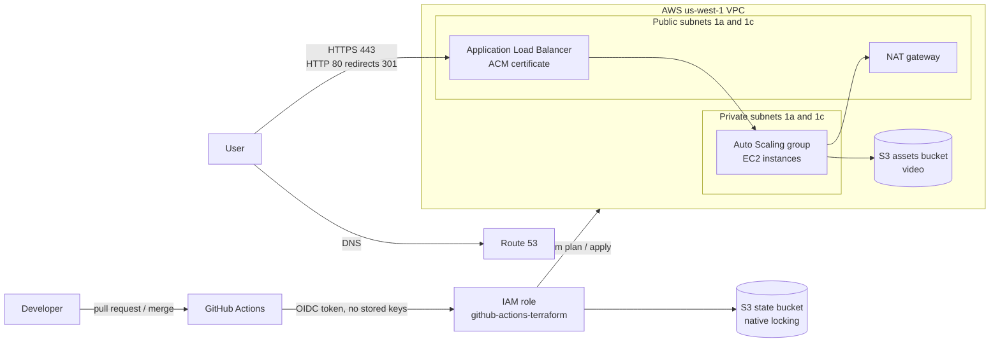
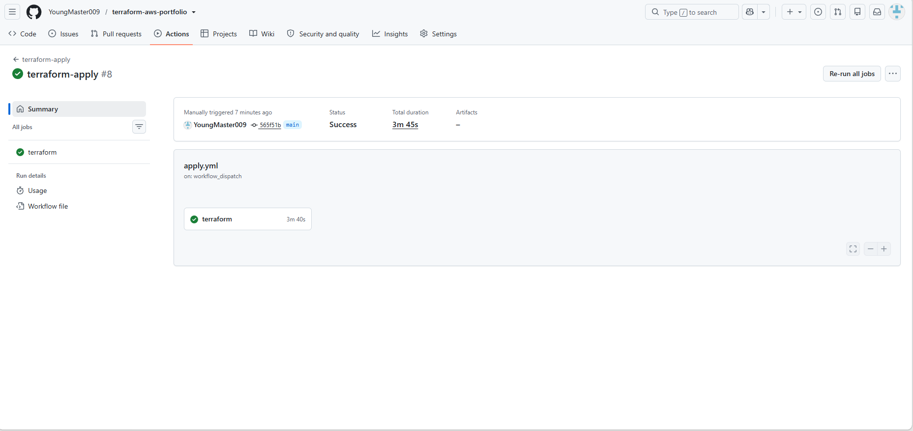

# terraform-aws-portfolio

A multi-tier AWS web stack built entirely with Terraform, deployed through a GitHub Actions pipeline that plans every pull request and deploys on demand. No AWS keys are stored in GitHub.

**Live site:** https://dev.doiwannaknowthediaryofjane.com
The stack is torn down when not in use to control cost and deployed on demand through GitHub Actions.



## What's built

- **VPC** across two availability zones (us-west-1a, us-west-1c) with public and private subnets and a NAT gateway
- **Application Load Balancer** serving HTTPS on 443 with an ACM certificate validated through Route 53; HTTP on 80 redirects with a 301
- **Auto Scaling group** in private subnets, with rolling instance refresh when the launch template changes
- **Route 53** DNS for the apex domain (prod) and the dev subdomain
- **S3 assets bucket**, read by instances through an IAM instance role scoped to that bucket only
- **AWS WAF** with an IP block list and AWS managed rules, behind a toggle that is off by default to save cost
- **Remote state** in S3 with native locking, and a separate state file per environment

## Architecture



## Repository layout

```
bootstrap/          GitHub OIDC provider and the IAM role that Actions assumes
environments/dev/   dev root: dev subdomain, 10.33.0.0/16, ASG 1/1/2
environments/prod/  prod root: apex domain, 10.32.0.0/16, ASG 2/2/4
modules/network/    VPC, subnets, NAT gateway, routing
modules/compute/    ALB, target group, launch template, Auto Scaling group
modules/app/        ACM certificate, DNS records, assets bucket, WAF
.github/workflows/  terraform.yml (plan on PR), apply.yml (apply and destroy)
```

## How deployment works

1. Every pull request to `main` runs `terraform fmt -check`, `validate` and `plan` against dev.
2. `main` is protected: changes need a pull request and a passing `plan` check, with no bypass.
3. Merging changes to infrastructure files applies dev automatically.
4. Apply or destroy can be run by hand from the Actions tab.
5. A nightly scheduled destroy tears dev down so nothing runs overnight.

GitHub Actions authenticates to AWS with OIDC. Each run gets short-lived credentials from an IAM role that trusts only this repository, matched by its immutable owner and repository IDs. The role has a scoped policy instead of AdministratorAccess, and it can't touch the bootstrap state or its own role.



## Cost

The main costs (NAT gateway, ALB and EC2) are billed hourly, so the stack runs only when needed. All testing in September 2026 cost $3.42 in total. The Route 53 hosted zone is $0.50 a month. WAF is off by default because it adds about $5 a month plus $1 per rule.

## Problems solved

- **Timeout vs 503 vs 502:** three symptoms, three causes. A timeout points at security groups, a 503 at no healthy targets, and a 502 at targets still booting.
- **The dependency cycle that wasn't:** compute needs outputs from app and app needs outputs from compute, but Terraform builds its graph per input and output, not per module, so there was no cycle.
- **The plan check that caught prod pointing at dev:** filtering the plan before apply showed prod still using the dev domain.
- **HTTPS for real users:** browsers upgrade to HTTPS on their own, so I added an ACM certificate, a 443 listener and a 301 redirect, then proved the redirect came from the ALB with `curl -I`.
- **Perpetual diff on the video upload:** a multipart upload's ETag never matches an MD5, so I switched to `source_hash`.
- **Who owns the instances:** I terminated the only dev instance and the site returned a 503 until the Auto Scaling group replaced it about 8 minutes later. Terraform never saw a change, because it manages the group, not the instances.
- **Line-ending drift:** a laptop plan showed changes the pipeline didn't. Decoding the base64 user data showed `#!/bin/bash\r\n`, Windows CRLF instead of Linux LF, which would break the script on boot. A `.gitattributes` rule (`*.sh text eol=lf`) fixed it, proven by a clean plan.

## Running it

```
cd environments/dev
terraform init
terraform apply
terraform destroy
```

## Planned

- Add an S3 gateway VPC endpoint so instances reach S3 without the NAT gateway
- Add a permissions boundary to the dev- and prod- roles so the deploy role can't grant an instance role broad permissions

## Credits

Background video by Pachon in Motion via Pexels.